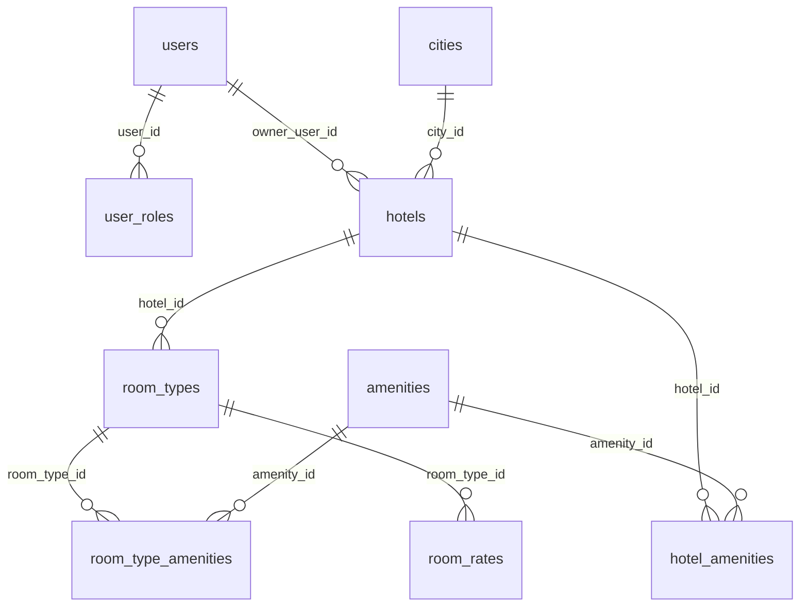
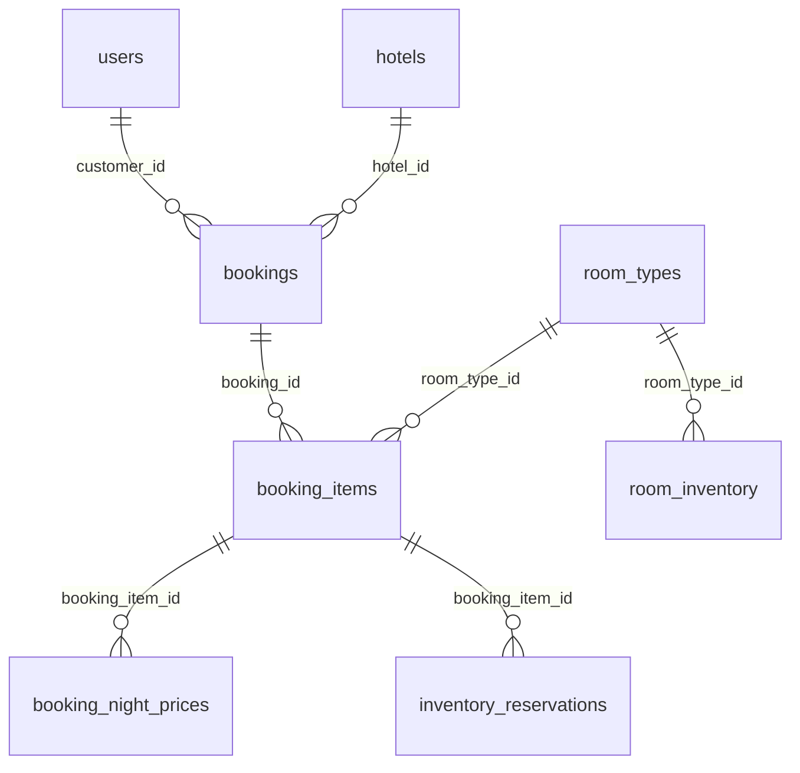
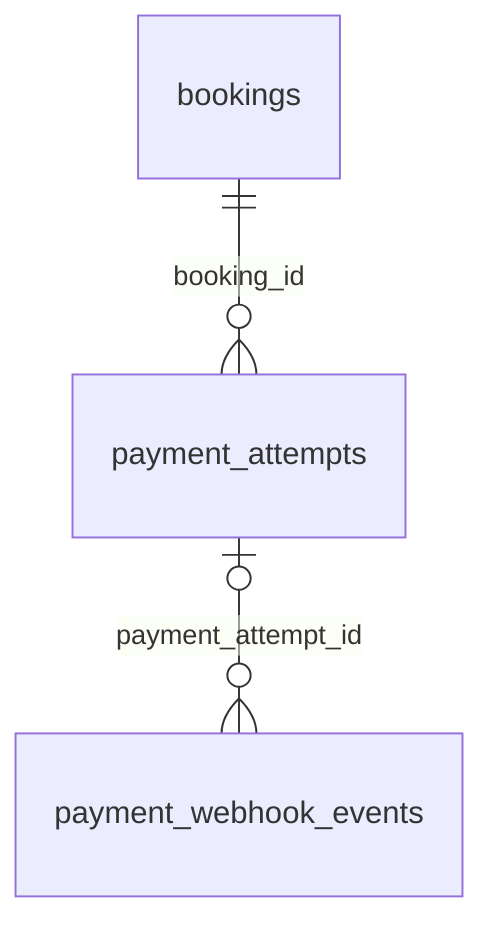

# Cơ sở dữ liệu StayHub

> Lược đồ PostgreSQL.

## Mục lục

- [Tổng quan](#tổng-quan)
- [Sơ đồ ERD](#sơ-đồ-erd)
- [Quan hệ khóa ngoại](#quan-hệ-khóa-ngoại)
- [Cấu trúc bảng](#cấu-trúc-bảng)

## Tổng quan

Lược đồ gồm **16 bảng**, chia thành bốn nhóm để dễ tìm và đọc:

| Nhóm                 | Bảng                                                                                                                                                                                                                |
|----------------------|---------------------------------------------------------------------------------------------------------------------------------------------------------------------------------------------------------------------|
| Tài khoản            | [`users`](#users), [`user_roles`](#user_roles)                                                                                                                                                                      |
| Danh mục khách sạn   | [`cities`](#cities), [`hotels`](#hotels), [`room_types`](#room_types), [`amenities`](#amenities), [`hotel_amenities`](#hotel_amenities), [`room_type_amenities`](#room_type_amenities), [`room_rates`](#room_rates) |
| Đặt phòng và tồn kho | [`bookings`](#bookings), [`booking_items`](#booking_items), [`booking_night_prices`](#booking_night_prices), [`inventory_reservations`](#inventory_reservations), [`room_inventory`](#room_inventory)               |
| Thanh toán           | [`payment_attempts`](#payment_attempts), [`payment_webhook_events`](#payment_webhook_events)                                                                                                                        |

**Quy ước:** `PK` là khóa chính, `FK` là khóa ngoại. Các cột tiền dùng `BIGINT`; ghi chú của `room_rates.amount` quy
định lưu theo đơn vị tiền tệ nhỏ nhất (ví dụ VND hoặc cent). Ngày lưu trú được lưu riêng cho giá phòng, tồn kho và giữ
chỗ.

## Sơ đồ ERD

Các sơ đồ chỉ hiện tên bảng và cột khóa ngoại để đường nối dễ theo dõi. Kiểu dữ liệu, khóa chính, giá trị mặc định và
ghi chú nằm trong [cấu trúc bảng](#cấu-trúc-bảng). Ký hiệu `o|` ở quan hệ cuối cho biết
`payment_webhook_events.payment_attempt_id` có thể là `NULL`.

### 1. Tài khoản và danh mục khách sạn

### 2. Đặt phòng và tồn kho

### 3. Thanh toán

## Quan hệ khóa ngoại

Mỗi hàng đi từ bảng chứa khóa ngoại đến bảng được tham chiếu. Một bản ghi ở bảng được tham chiếu có thể liên kết với
nhiều bản ghi ở bảng chứa khóa ngoại.

| Bảng chứa FK             | Cột FK               | Tham chiếu đến     |
|--------------------------|----------------------|--------------------|
| `user_roles`             | `user_id`            | `users`            |
| `hotels`                 | `owner_user_id`      | `users`            |
| `hotels`                 | `city_id`            | `cities`           |
| `room_types`             | `hotel_id`           | `hotels`           |
| `hotel_amenities`        | `hotel_id`           | `hotels`           |
| `hotel_amenities`        | `amenity_id`         | `amenities`        |
| `room_type_amenities`    | `room_type_id`       | `room_types`       |
| `room_type_amenities`    | `amenity_id`         | `amenities`        |
| `room_rates`             | `room_type_id`       | `room_types`       |
| `bookings`               | `customer_id`        | `users`            |
| `bookings`               | `hotel_id`           | `hotels`           |
| `booking_items`          | `booking_id`         | `bookings`         |
| `booking_items`          | `room_type_id`       | `room_types`       |
| `booking_night_prices`   | `booking_item_id`    | `booking_items`    |
| `inventory_reservations` | `booking_item_id`    | `booking_items`    |
| `room_inventory`         | `room_type_id`       | `room_types`       |
| `payment_attempts`       | `booking_id`         | `bookings`         |
| `payment_webhook_events` | `payment_attempt_id` | `payment_attempts` |

## Cấu trúc bảng

### Tài khoản

#### users

| Cột               | Kiểu dữ liệu | Ràng buộc                                   | Tham chiếu | Ghi chú |
|-------------------|--------------|---------------------------------------------|------------|---------|
| **id**            | UUID         | 🔑 PK, not null, default: gen_random_uuid() |            |         |
| **email**         | VARCHAR(255) | not null, unique                            |            |         |
| **password_hash** | VARCHAR(255) | not null                                    |            |         |
| **full_name**     | VARCHAR(100) | not null                                    |            |         |
| **phone**         | VARCHAR(20)  | not null, unique                            |            |         |
| **status**        | STATUS       | not null, default: pending                  |            |         |
| **created_at**    | TIMESTAMPTZ  | not null, default: now()                    |            |         |
| **updated_at**    | TIMESTAMPTZ  | not null, default: now()                    |            |         |

#### user_roles

| Cột         | Kiểu dữ liệu | Ràng buộc       | Tham chiếu                  | Ghi chú |
|-------------|--------------|-----------------|-----------------------------|---------|
| **user_id** | UUID         | 🔑 PK, not null | fk_user_roles_user_id_users |         |
| **role**    | ROLES        | 🔑 PK, not null |                             |         |

### Danh mục khách sạn

#### cities

| Cột              | Kiểu dữ liệu | Ràng buộc                                   | Tham chiếu | Ghi chú                               |
|------------------|--------------|---------------------------------------------|------------|---------------------------------------|
| **id**           | UUID         | 🔑 PK, not null, default: gen_random_uuid() |            |                                       |
| **country_code** | CHAR(2)      | not null                                    |            | ISO 3166-1 alpha-2, ví dụ: VN, US, JP |
| **name**         | VARCHAR(100) | not null                                    |            |                                       |
| **slug**         | VARCHAR(150) | not null, unique                            |            |                                       |

#### hotels

| Cột                | Kiểu dữ liệu    | Ràng buộc                                   | Tham chiếu                    | Ghi chú     |
|--------------------|-----------------|---------------------------------------------|-------------------------------|-------------|
| **id**             | UUID            | 🔑 PK, not null, default: gen_random_uuid() |                               |             |
| **owner_user_id**  | UUID            | not null                                    | fk_hotels_owner_user_id_users |             |
| **city_id**        | UUID            | not null                                    | fk_hotels_city_id_cities      |             |
| **name**           | VARCHAR(255)    | not null                                    |                               |             |
| **slug**           | VARCHAR(255)    | not null, unique                            |                               |             |
| **description**    | TEXT            | null                                        |                               |             |
| **address**        | VARCHAR(255)    | not null                                    |                               |             |
| **latitude**       | DECIMAL(9,6)    | null                                        |                               |             |
| **longitude**      | DECIMAL(9,6)    | null                                        |                               |             |
| **star_rating**    | SMALLINT        | null                                        |                               | 1 đến 5 sao |
| **check_in_time**  | TIME            | not null, default: 14:00:00                 |                               |             |
| **check_out_time** | TIME            | not null, default: 12:00:00                 |                               |             |
| **status**         | HOTEL_STATUS__T | not null, default: draft                    |                               |             |
| **created_at**     | TIMESTAMPTZ     | not null, default: now()                    |                               |             |
| **updated_at**     | TIMESTAMPTZ     | not null, default: now()                    |                               |             |

#### room_types

| Cột              | Kiểu dữ liệu | Ràng buộc                                   | Tham chiếu                    | Ghi chú                           |
|------------------|--------------|---------------------------------------------|-------------------------------|-----------------------------------|
| **id**           | UUID         | 🔑 PK, not null, default: gen_random_uuid() |                               |                                   |
| **hotel_id**     | UUID         | not null                                    | fk_room_types_hotel_id_hotels |                                   |
| **name**         | VARCHAR(100) | not null                                    |                               | Ví dụ: Deluxe King, Standard Twin |
| **description**  | TEXT         | null                                        |                               |                                   |
| **max_adults**   | SMALLINT     | not null, default: 2                        |                               |                                   |
| **max_children** | SMALLINT     | not null, default: 0                        |                               |                                   |
| **is_active**    | BOOLEAN      | not null, default: true                     |                               |                                   |

#### amenities

| Cột          | Kiểu dữ liệu        | Ràng buộc                                   | Tham chiếu | Ghi chú                                                 |
|--------------|---------------------|---------------------------------------------|------------|---------------------------------------------------------|
| **id**       | UUID                | 🔑 PK, not null, default: gen_random_uuid() |            |                                                         |
| **code**     | VARCHAR(50)         | not null, unique                            |            | Mã định danh viết liền, ví dụ: FREE_WIFI, SWIMMING_POOL |
| **name**     | VARCHAR(100)        | not null                                    |            | Tên hiển thị: Free Wi-Fi, Hồ bơi                        |
| **category** | AMENITY_CATEGORY__T | not null, default: room                     |            |                                                         |

#### hotel_amenities

| Cột            | Kiểu dữ liệu | Ràng buộc       | Tham chiếu                              | Ghi chú |
|----------------|--------------|-----------------|-----------------------------------------|---------|
| **hotel_id**   | UUID         | 🔑 PK, not null | fk_hotel_amenities_hotel_id_hotels      |         |
| **amenity_id** | UUID         | 🔑 PK, not null | fk_hotel_amenities_amenity_id_amenities |         |

#### room_type_amenities

| Cột              | Kiểu dữ liệu | Ràng buộc       | Tham chiếu                                     | Ghi chú |
|------------------|--------------|-----------------|------------------------------------------------|---------|
| **room_type_id** | UUID         | 🔑 PK, not null | fk_room_type_amenities_room_type_id_room_types |         |
| **amenity_id**   | UUID         | 🔑 PK, not null | fk_room_type_amenities_amenity_id_amenities    |         |

#### room_rates

| Cột              | Kiểu dữ liệu | Ràng buộc              | Tham chiếu                            | Ghi chú                                                                     |
|------------------|--------------|------------------------|---------------------------------------|-----------------------------------------------------------------------------|
| **room_type_id** | UUID         | 🔑 PK, not null        | fk_room_rates_room_type_id_room_types |                                                                             |
| **rate_date**    | DATE         | 🔑 PK, not null        |                                       |                                                                             |
| **amount**       | BIGINT       | not null               |                                       | Lưu theo đơn vị tiền tệ nhỏ nhất (ví dụ VND hoặc Cent) để tránh lỗi số thực |
| **currency**     | CHAR(3)      | not null, default: VND |                                       | Chuẩn ISO 4217: VND, USD, EUR                                               |

### Đặt phòng và tồn kho

#### bookings

| Cột                 | Kiểu dữ liệu      | Ràng buộc                                   | Tham chiếu                    | Ghi chú                                                    |
|---------------------|-------------------|---------------------------------------------|-------------------------------|------------------------------------------------------------|
| **id**              | UUID              | 🔑 PK, not null, default: gen_random_uuid() |                               |                                                            |
| **booking_code**    | VARCHAR(20)       | not null, unique                            |                               | Mã đặt phòng dạng ngắn cho khách, ví dụ: BK-2026-X9A2      |
| **customer_id**     | UUID              | not null                                    | fk_bookings_customer_id_users |                                                            |
| **hotel_id**        | UUID              | not null                                    | fk_bookings_hotel_id_hotels   |                                                            |
| **check_in**        | DATE              | not null                                    |                               |                                                            |
| **check_out**       | DATE              | not null                                    |                               |                                                            |
| **adults**          | SMALLINT          | not null, default: 1                        |                               |                                                            |
| **children**        | SMALLINT          | not null, default: 0                        |                               |                                                            |
| **status**          | BOOKING_STATUS__T | not null, default: pending_payment          |                               |                                                            |
| **currency**        | CHAR(3)           | not null, default: VND                      |                               |                                                            |
| **subtotal_amount** | BIGINT            | not null, default: 0                        |                               | Tổng tiền phòng trước giảm                                 |
| **discount_amount** | BIGINT            | not null, default: 0                        |                               | Tiền giảm từ voucher/khuyến mãi                            |
| **total_amount**    | BIGINT            | not null, default: 0                        |                               | Số tiền khách thực tế phải trả                             |
| **expires_at**      | TIMESTAMPTZ       | null                                        |                               | Hạn chót giữ chỗ để thanh toán trước khi tự động hủy (TTL) |
| **created_at**      | TIMESTAMPTZ       | not null, default: now()                    |                               |                                                            |
| **updated_at**      | TIMESTAMPTZ       | not null, default: now()                    |                               |                                                            |

#### booking_items

| Cột                         | Kiểu dữ liệu | Ràng buộc                                   | Tham chiếu                               | Ghi chú                                                                                   |
|-----------------------------|--------------|---------------------------------------------|------------------------------------------|-------------------------------------------------------------------------------------------|
| **id**                      | UUID         | 🔑 PK, not null, default: gen_random_uuid() |                                          |                                                                                           |
| **booking_id**              | UUID         | not null                                    | fk_booking_items_booking_id_bookings     |                                                                                           |
| **room_type_id**            | UUID         | not null                                    | fk_booking_items_room_type_id_room_types |                                                                                           |
| **room_type_name_snapshot** | VARCHAR(100) | not null                                    |                                          | Lưu vết tên loại phòng tại thời điểm đặt, tránh việc sau này đổi tên làm sai lệch hóa đơn |
| **quantity**                | SMALLINT     | not null, default: 1                        |                                          |                                                                                           |
| **adults**                  | SMALLINT     | not null, default: 1                        |                                          |                                                                                           |
| **children**                | SMALLINT     | not null, default: 0                        |                                          |                                                                                           |

#### booking_night_prices

| Cột                 | Kiểu dữ liệu | Ràng buộc       | Tham chiếu                                            | Ghi chú                  |
|---------------------|--------------|-----------------|-------------------------------------------------------|--------------------------|
| **booking_item_id** | UUID         | 🔑 PK, not null | fk_booking_night_prices_booking_item_id_booking_items |                          |
| **stay_date**       | DATE         | 🔑 PK, not null |                                                       |                          |
| **unit_price**      | BIGINT       | not null        |                                                       | Giá 1 phòng trong đêm đó |

#### inventory_reservations

| Cột                 | Kiểu dữ liệu                    | Ràng buộc                | Tham chiếu                                              | Ghi chú |
|---------------------|---------------------------------|--------------------------|---------------------------------------------------------|---------|
| **booking_item_id** | UUID                            | 🔑 PK, not null          | fk_inventory_reservations_booking_item_id_booking_items |         |
| **stay_date**       | DATE                            | 🔑 PK, not null          |                                                         |         |
| **quantity**        | SMALLINT                        | not null                 |                                                         |         |
| **status**          | INVENTORY_RESERVATION_STATUS__T | not null, default: held  |                                                         |         |
| **expires_at**      | TIMESTAMPTZ                     | null                     |                                                         |         |
| **created_at**      | TIMESTAMPTZ                     | not null, default: now() |                                                         |         |
| **released_at**     | TIMESTAMPTZ                     | null                     |                                                         |         | 

##### Chỉ mục

- Chỉ mục trên `status, expires_at`. Bản xuất DrawDB không ghi tên hoặc tính duy nhất của chỉ mục.

#### room_inventory

| Cột                    | Kiểu dữ liệu | Ràng buộc            | Tham chiếu                                | Ghi chú |
|------------------------|--------------|----------------------|-------------------------------------------|---------|
| **room_type_id**       | UUID         | 🔑 PK, not null      | fk_room_inventory_room_type_id_room_types |         |
| **inventory_date**     | DATE         | 🔑 PK, not null      |                                           |         |
| **total_inventory**    | INTEGER      | not null             |                                           |         |
| **reserved_inventory** | INTEGER      | not null, default: 0 |                                           |         |

### Thanh toán

#### payment_attempts

| Cột                         | Kiểu dữ liệu      | Ràng buộc                                   | Tham chiếu                              | Ghi chú                                                                |
|-----------------------------|-------------------|---------------------------------------------|-----------------------------------------|------------------------------------------------------------------------|
| **id**                      | UUID              | 🔑 PK, not null, default: gen_random_uuid() |                                         |                                                                        |
| **booking_id**              | UUID              | not null                                    | fk_payment_attempts_booking_id_bookings |                                                                        |
| **attempt_number**          | SMALLINT          | not null, default: 1                        |                                         | Lần thử thứ mấy (1, 2, 3...) cho đơn này                               |
| **method**                  | PAYMENT_METHOD__T | not null                                    |                                         |                                                                        |
| **status**                  | PAYMENT_STATUS__T | not null, default: pending                  |                                         |                                                                        |
| **amount**                  | BIGINT            | not null                                    |                                         | Số tiền cần thanh toán của lần thử này                                 |
| **currency**                | CHAR(3)           | not null, default: VND                      |                                         |                                                                        |
| **idempotency_key**         | VARCHAR(255)      | not null, unique                            |                                         | Khóa chống trùng lặp giao dịch (Idempotency Key)                       |
| **gateway_transaction_ref** | VARCHAR(255)      | null                                        |                                         | Mã giao dịch trả về từ cổng thanh toán (VNPay TranNo, Stripe Ch_id...) |
| **created_at**              | TIMESTAMPTZ       | not null, default: now()                    |                                         |                                                                        |
| **updated_at**              | TIMESTAMPTZ       | not null, default: now()                    |                                         |                                                                        |
| **succeeded_at**            | TIMESTAMPTZ       | null                                        |                                         | Thời điểm ghi nhận giao dịch thanh toán thành công                     |

#### payment_webhook_events

| Cột                    | Kiểu dữ liệu                 | Ràng buộc                                   | Tham chiếu                                                    | Ghi chú                                                                 |
|------------------------|------------------------------|---------------------------------------------|---------------------------------------------------------------|-------------------------------------------------------------------------|
| **id**                 | UUID                         | 🔑 PK, not null, default: gen_random_uuid() |                                                               |                                                                         |
| **payment_attempt_id** | UUID                         | null                                        | fk_payment_webhook_events_payment_attempt_id_payment_attempts | Có thể null nếu webhook gửi về nhưng chưa map được ngay với attempt nào |
| **provider**           | VARCHAR(50)                  | not null                                    |                                                               | vnpay, momo, stripe, v.v.                                               |
| **provider_event_id**  | VARCHAR(255)                 | null                                        |                                                               | Event ID duy nhất do cổng thanh toán cấp                                |
| **event_type**         | VARCHAR(100)                 | not null                                    |                                                               | Loại sự kiện, ví dụ: payment_intent.succeeded                           |
| **processing_status**  | WEBHOOK_PROCESSING_STATUS__T | not null, default: pending                  |                                                               |                                                                         |
| **received_at**        | TIMESTAMPTZ                  | not null, default: now()                    |                                                               |                                                                         |
| **processed_at**       | TIMESTAMPTZ                  | null                                        |                                                               |                                                                         |
